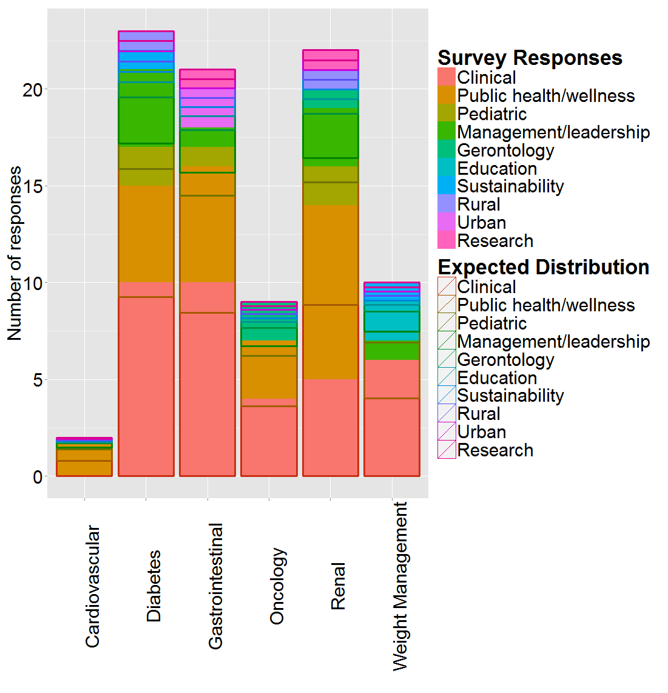
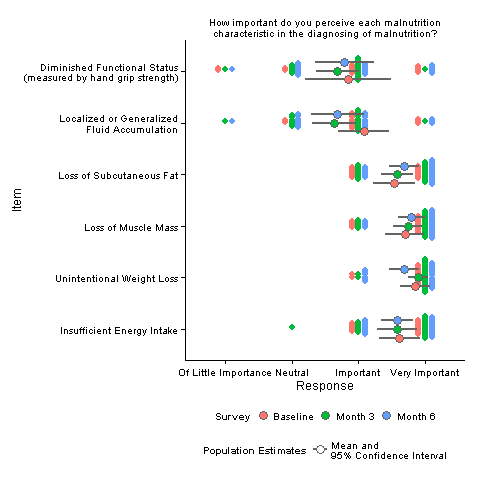
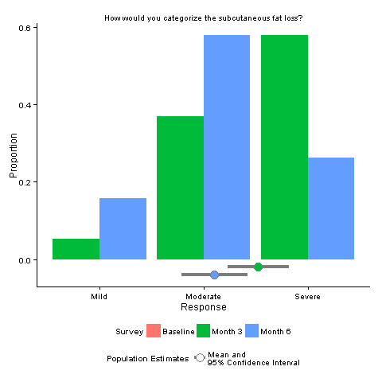
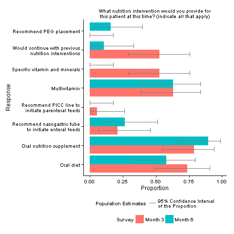

# MultipleResponseR

This repo started as a simple ggplot recipe for visualizing a chi-suqared test of the results from a multiple response (i.e. checkboxes) survey question stratified by another factor. It grew into a library of functions to read in an arbitrary Survey Monkey xls export and create appopriate visualizations for each question. It will soon be converted into an R package. 

* loadSurveyMonkeyXLS - reads in a an XLS export of response data from SurveyMonkey and deduces the question type from the properties of the data. Currently identifies the following question formats: numeric response, numeric response block, multiple choice question (radio buttons), multiple choice question matrix, multiple response question (checkboxes), multiple response question matrix
* multipleResponsePlot - plots a bar graph of the survey responses from a multiple response question, categorizing and color coding responses by the respondent's answer to another question in the survey (for example, by age group or gender). Also overlays what the response distribution would look like if the category factor has no effect on the responses (a chi-square test's "expected" distribution) 

* explorePlots - takes the output from loadSurveyMonkeyXLS and creates an appropriate plot for each question or block based on its identified type and estimates the population parameter based on the data type. If the levels are provided, ordinal-scaled questions are treated appropriately and a population mean is estimated. Can take multiple data files from repetitions of a survey and compare changes from survey to survey over time by automatically matching questions by name. Automatically adjusts text to fit in the plots by adding line breaks and rotating the plot as necessary. The following plots were created with these functions and no manual tweaking:  

